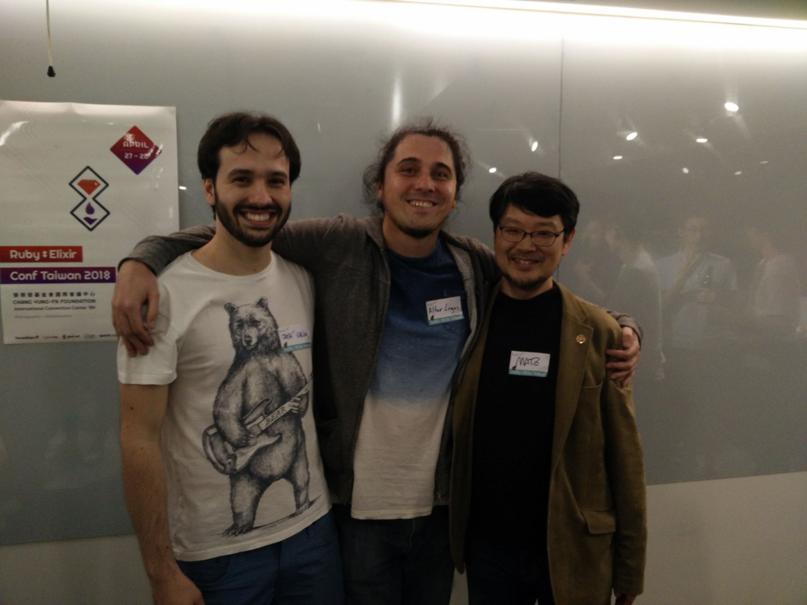

<h1 align="center">
  Hey there , I'm Alter
</h1>
<h3 align="center">
  A 🇨🇱 developer, living in 🇳🇿 and currently working on
  <a href="https://vworkapp.com/" target="_blank">vWork</a>.
</h3>

  
  
  
  
  

<h3 align="center">
  🧰 Tech Stack
</h3>

  
  
  
  
  

<h3 align="center">
  🧩 Open Source Contributions
</h3>

  <a href="https://github.com/meloncargo/facturapi">facturapi</a> — SOAP integration for Ruby with Chilean SII (tax system) 
  <a href="https://github.com/meloncargo/dragonfly-azure_data_store">dragonfly-azure_data_store</a> — Azure backend for the <a href="https://github.com/markevans/dragonfly" target="_blank">
    Dragonfly
  </a> gem

  

    
Minor patches in:

    

      <a href="https://github.com/visfleet/myob-api/commits?author=alagos">myob-api</a> 
      <a href="https://github.com/SAML-Toolkits/ruby-saml/commits?author=alagos">ruby-saml</a> 
      <a href="https://github.com/tagliala/coveralls-ruby-reborn/commits?author=alagos">coveralls-ruby-reborn</a> 
      <a href="https://github.com/igorkasyanchuk/rails_performance/commits?author=alagos">rails_performance</a> 
    

  

<h3 align="center">
  🌱 Exploring / Interested in
</h3>

  
  

  

    
Nobody cares, but

    I went into groupie mode and I had a photo with these guys 🤩
    

  

